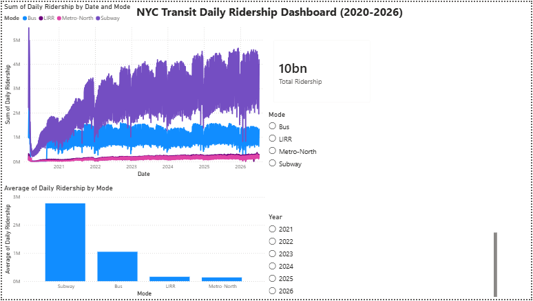
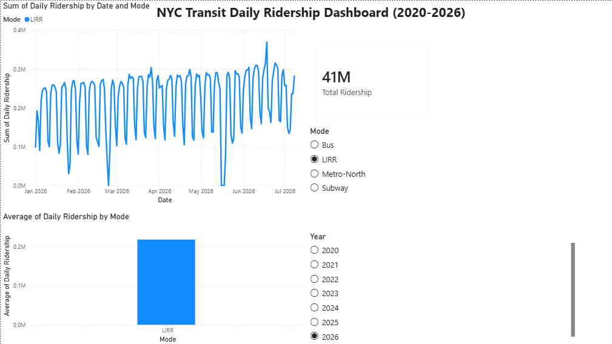

# NYC Transit Ridership Dashboard (Power BI)

This is my first Power BI project! I built an interactive dashboard to explore 
how daily MTA ridership has changed from 2020 to 2026 across the Subway, Bus, 
LIRR, and Metro-North.

I'm a CIS student at Baruch College interested in data analytics, and I wanted 
hands-on practice turning a real public dataset (over 6 years of daily data) 
into clear reports and charts that someone could actually use to answer questions.

## What the dashboard does
- **Line chart** showing daily ridership trends for all 4 transit modes over time
- **Bar chart** comparing average daily ridership by mode
- **KPI card** displaying total ridership, calculated with a DAX measure I wrote
- **Interactive slicers** for year and transit mode — selecting any combination 
  instantly filters every visual on the page

## What I practiced building this
- **Data cleaning in Power Query:** checked data types, filtered out non-transit 
  categories (congestion pricing entries) so the analysis stayed accurate
- **DAX:** wrote my first measure (`Total Ridership = SUM(...)`)
- **Report & chart design:** choosing the right visual for each question and 
  keeping the layout clean and readable
- **Attention to detail:** verifying the numbers made sense at each step 
  (like catching that subway ridership dips every weekend!)

## Preview

## Data Source
[MTA Daily Ridership and Traffic: Beginning 2020](https://data.ny.gov) — 
New York State Open Data, updated daily

## Testing
I validated the dashboard against a 12-case UAT plan covering slicer
interactions, KPI accuracy against the source data, and data quality
checks. All 12 passed, and I found and fixed one real display bug along
the way. See [uat-test-plan.md](uat-test-plan.md).
